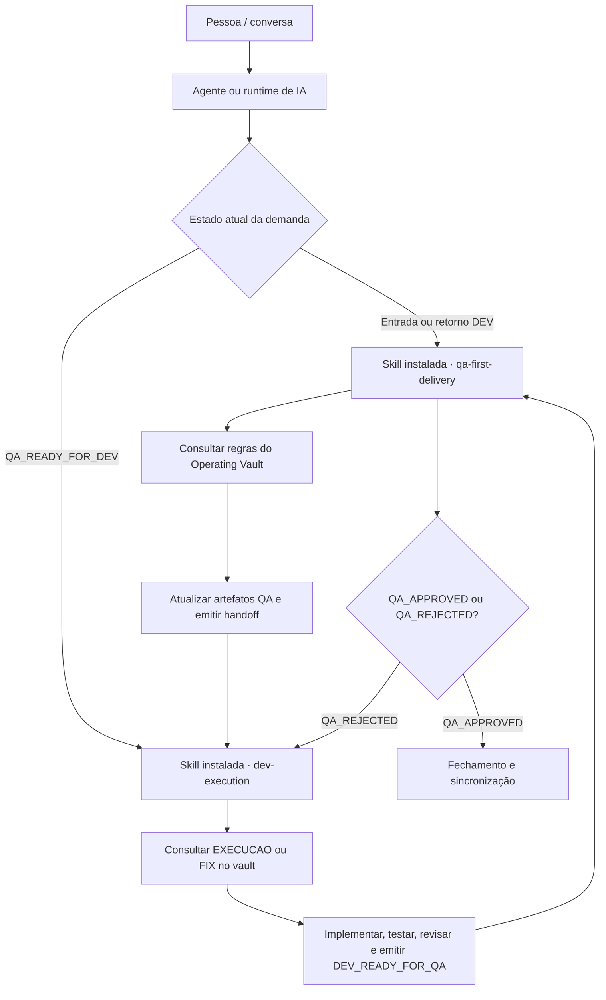
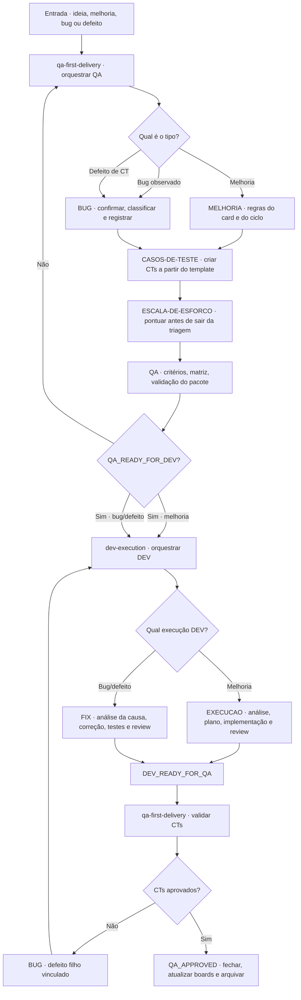

# Mapa geral de skills

Esta página mostra como as skills do Operating Vault se relacionam. Ela complementa o [[04 - Fluxo QA DEV|Fluxo QA → DEV]]: o fluxo QA/DEV define as grandes etapas; este mapa define qual regra especializada é usada dentro de cada etapa.

## Princípio de roteamento

`qa-first-delivery` e `dev-execution` são as skills orquestradoras do ciclo. As demais notas em `Skills/` são regras especializadas do vault: elas não precisam ser chamadas pelo usuário como comandos independentes. A etapa atual e o tipo de trabalho determinam quais regras devem ser consultadas.

O fluxo é orientado por estado e artefatos. Uma palavra como “siga” pode indicar continuidade da conversa, mas não substitui o gate nem muda o responsável da etapa.

## Camadas: agente, skill instalada e regra do vault

Há três camadas diferentes:

1. **Agente/runtime:** Codex, OpenCode ou outra IA que recebe a conversa e possui permissões para ler/escrever.
2. **Skill instalada:** instrução operacional que o agente carrega automaticamente. Atualmente, no Codex, `qa-first-delivery` e `dev-execution` são as skills orquestradoras deste fluxo.
3. **Regra do vault:** notas como `MELHORIA`, `BUG`, `CASOS-DE-TESTE`, `EXECUCAO` e `FIX`. Elas são a fonte de processo compartilhada; as skills instaladas devem consultá-las e aplicá-las.

O agente não “chama” uma nota Markdown do vault como se fosse uma skill executável. Ele carrega a skill instalada, e essa skill consulta as regras do vault. O handoff entre agentes/skills acontece pelo estado e pelos eventos documentados (`QA_READY_FOR_DEV`, `DEV_READY_FOR_QA`, `QA_REJECTED` e `QA_APPROVED`).

### Agentes especializados de projeto

Agentes adicionais pertencem ao contexto do projeto que os utiliza. Eles não fazem parte automaticamente do fluxo universal e devem ser documentados em `04 Projetos/<projeto>/` ou na configuração do próprio repositório.

Um agente especializado deve declarar o projeto atendido, a responsabilidade, o momento de entrada, as permissões, o artefato de saída e o próximo handoff. Ele não substitui `qa-first-delivery` ou `dev-execution` sem uma decisão explícita do Operating Vault.

## Mapa visual

## Responsabilidade e próxima entrega

| Skill/regra | Tipo | Entra quando | Produz | Entrega para |
|---|---|---|---|---|
| `qa-first-delivery` | Orquestradora QA | qualquer ideia, melhoria, bug ou retorno do DEV | pacote QA, gate e validação funcional | `dev-execution` ou fechamento |
| `MELHORIA` | Regra de demanda | o trabalho funciona, mas pode melhorar | card de melhoria e regras do ciclo | `CASOS-DE-TESTE` e QA |
| `BUG` | Regra de demanda | há comportamento incorreto ou CT reprovado | bug/defeito com reprodução, ambiente e critérios | `CASOS-DE-TESTE` e QA/DEV |
| `CASOS-DE-TESTE` | Regra de cobertura | há critérios de aceite definidos | CTs, âncoras e matriz de cobertura | validação QA |
| `ESCALA-DE-ESFORCO` | Regra de estimativa | item precisa sair da triagem | `pontos` e progresso derivado | demanda/execução |
| `dev-execution` | Orquestradora DEV | `QA_READY_FOR_DEV` foi emitido | execução técnica e handoff DEV | `EXECUCAO`, `FIX` ou QA |
| `EXECUCAO` | Regra de execução | handoff é uma melhoria aprovada | análise, plano, implementação e review | `DEV_READY_FOR_QA` |
| `FIX` | Regra de correção | handoff é bug/defeito confirmado | causa, correção, testes e review | `DEV_READY_FOR_QA` |

## Matriz de agentes e skills instaladas

| Runtime/agente | Skills instaladas no escopo | Papel no fluxo universal |
|---|---|---|
| Agente com `qa-first-delivery` e `dev-execution` | skills orquestradoras | Executa o ciclo QA → DEV → QA completo |
| Agente especialista de projeto | depende do projeto e da configuração | Atua somente no ponto documentado do projeto |
| Outra IA/agente | depende da instalação/configuração | Deve ler `Skills/README.md` e seguir os eventos do fluxo |

## Regras de chamada

1. Uma entrada nova começa em `qa-first-delivery`; o usuário não precisa escolher a skill seguinte.
2. `MELHORIA` ou `BUG` define o formato da demanda; não se misturam no mesmo card.
3. `CASOS-DE-TESTE` é usado depois dos critérios e antes do `QA_READY_FOR_DEV`; não é uma etapa paralela ao QA.
4. `ESCALA-DE-ESFORCO` é consultada antes de a demanda sair de `QA · Triagem`.
5. `dev-execution` só assume depois de `QA_READY_FOR_DEV`.
6. `EXECUCAO` atende melhorias; `FIX` atende bugs e defeitos. Ambos devolvem para QA, nunca aprovam funcionalmente.
7. `QA_REJECTED` abre ou vincula um defeito em `BUG` e devolve o trabalho para `dev-execution`.
8. `QA_APPROVED` encerra o ciclo e sincroniza demanda, execução, board, épico, roadmap e arquivo.

## Relação com o fluxo QA/DEV

- [[04 - Fluxo QA DEV|Fluxo QA → DEV]] — estados, gates e handoffs principais.
- [[05 - Contrato de interação QA DEV|Contrato de interação QA ↔ DEV]] — contrato entre as duas skills orquestradoras.
- [[Skills/README|Skills operacionais]] — índice das regras reutilizáveis.
