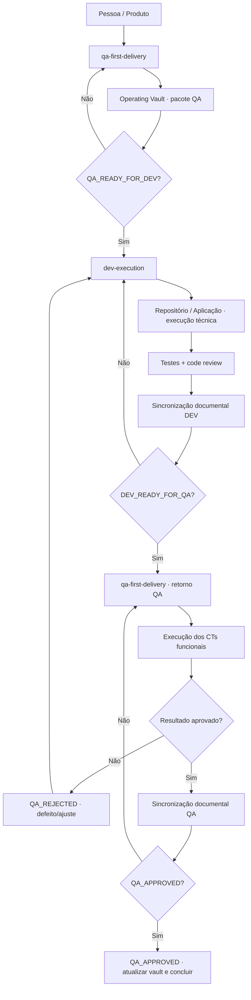

# Contrato de interação QA ↔ DEV

Esta página explica como as duas skills se comunicam e quem assume cada etapa. A versão canônica das regras está em [[Skills/QA-FIRST-DELIVERY|QA First Delivery]] e [[Skills/DEV-EXECUTION|DEV Execution]]; o diagrama abaixo é a fonte operacional da interação no vault.

## Regra principal

O usuário apresenta o trabalho. A etapa atual define a skill responsável e o próximo handoff. Não é necessário escolher manualmente a skill seguinte.

## Matriz de roteamento

| Estado atual | Skill ativa | Ação | Próximo estado |
|---|---|---|---|
| nova ideia, melhoria ou bug | `qa-first-delivery` | classificar, copiar os templates e preparar o QA | QA · Triagem/Análise |
| pacote QA incompleto | `qa-first-delivery` | corrigir contexto, critérios, CTs ou links | QA · Análise |
| pacote QA aprovado | `qa-first-delivery` → `dev-execution` | emitir `QA_READY_FOR_DEV` | DEV · Análise |
| execução técnica | `dev-execution` | analisar, planejar, implementar e testar | DEV · Code review |
| code review aprovado + sincronização DEV verificada | `dev-execution` → `qa-first-delivery` | emitir `DEV_READY_FOR_QA` | QA · Validação |
| CTs aprovados + sincronização QA verificada | `qa-first-delivery` | emitir `QA_APPROVED` e fechar | Concluído |
| CT reprovado/bloqueado | `qa-first-delivery` → `dev-execution` | emitir `QA_REJECTED` e vincular o defeito | DEV · Análise |

## Invariantes

1. QA não implementa antes de `QA_READY_FOR_DEV`.
2. DEV não inicia sem critérios, CTs e gate QA.
3. DEV não aprova CT funcional.
4. QA não altera silenciosamente o resultado esperado durante a validação.
5. Cada handoff atualiza frontmatter, README, board, links e evidências.
6. O fluxo é orientado por estado e artefatos; não depende de `siga` ou outra palavra-chave.
7. Sincronização documental é um gate obrigatório. Se houver divergência entre demanda, execução, boards, links, status ou evidências, o handoff permanece pendente.

## Checklist mínimo de sincronização

Antes de emitir qualquer evento de passagem, conferir:

- demanda e execução com frontmatter/etapa coerentes;
- README e status atualizados;
- board correto e sem card duplicado ou em coluna incompatível;
- links internos resolvendo entre QA, DEV, CTs e validação;
- evidências, histórico, pendências e datas atualizados;
- checklists da etapa concluídos;
- nenhum texto de template ou instrução obsoleta contradizendo o estado atual.

O responsável deve registrar a pendência quando a conferência falhar. Build, testes verdes ou CTs aprovados não substituem essa verificação.
