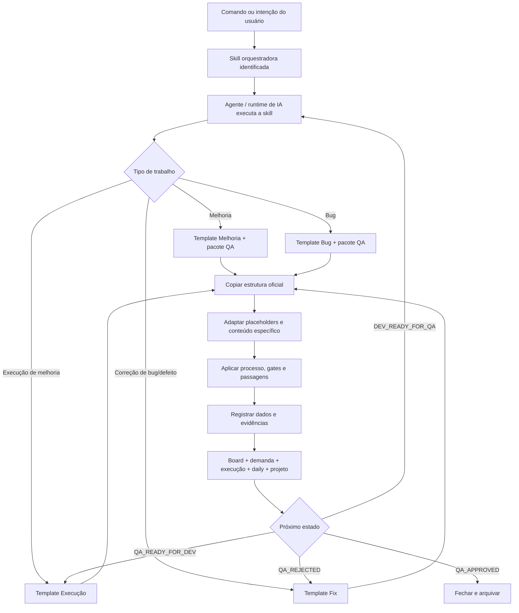

# Arquitetura operacional do vault

Este documento define como uma entrada humana vira um registro rastreável no Operating Vault. A arquitetura é universal; o projeto, o domínio e os dados concretos entram somente depois que o contexto é identificado.

## Cadeia principal

A cadeia é uma sequência lógica de responsabilidade, não uma linha única rígida: o tipo da entrada abre uma ramificação e os eventos de handoff fazem o ciclo retornar entre QA e DEV. Na execução técnica, o runtime do agente pode identificar e carregar a skill automaticamente. O princípio invariável é:

`Comando → Skill → Agente → Template → Processo → Dados`

## O que cada camada significa

| Camada | Responsabilidade | Não deve fazer |
|---|---|---|
| Comando/intenção | informar uma necessidade, relato, falha ou objetivo | escolher manualmente todos os artefatos |
| Skill | interpretar a etapa e aplicar regras | inventar estrutura diferente do vault |
| Agente | operar no runtime, ler contexto e executar a skill | misturar projetos ou ignorar permissões |
| Template | fornecer a estrutura canônica | ser reconstruído manualmente no card |
| Processo | definir etapas, critérios, gates e handoffs | ser substituído por “parece pronto” |
| Dados | registrar contexto, decisões, evidências e resultados | ficar apenas na conversa |

## Regra universal de template

Sempre executar nesta ordem:

1. localizar o template oficial do tipo correto;
2. copiar o template ou pacote completo para o destino do projeto;
3. conferir que headings, frontmatter, callouts, âncoras, tabelas e blocos de automação foram preservados;
4. substituir placeholders e adaptar somente o conteúdo específico;
5. validar links, critérios, CTs, status e referências antes do handoff;
6. registrar a saída no board e nos artefatos relacionados.

Nunca criar do zero uma estrutura equivalente quando existe template oficial. Se o template estiver incompleto, atualizar primeiro o template universal e somente depois criar novas instâncias.

## Matriz de templates

| Necessidade | Template de entrada | Complementos obrigatórios | Saída principal |
|---|---|---|---|
| Melhoria | `Templates/Melhoria/` | `Templates/QA/01–05` conforme o pacote | demanda QA pronta para gate |
| Bug observado | `Templates/Bug/` | `Templates/QA/03 - Casos de teste.md` e validação QA | bug reproduzível e coberto |
| Casos de teste | `Templates/QA/03 - Casos de teste.md` | critérios da demanda | CTs ancorados e matriz |
| Execução de melhoria | `Templates/Execução/` | demanda e CTs aprovados | execução DEV revisada |
| Correção de bug/defeito | `Templates/Fix/` | bug pai e CTs QA | fix revisado e pronto para QA |
| Registro diário | `Templates/Daily.md` | contexto do projeto quando aplicável | histórico rastreável |

## Separação universal × projeto

- Universal: `Skills/`, `Templates/`, `Agentes/` e `01 Board/Processos/`.
- Projeto: `04 Projetos/<projeto>/`, com domínio, decisões, roadmap e agentes especializados.
- Trabalho: `03 Trabalho/<camada>/<projeto>/`, com demandas e execuções concretas.
- Produto: repositório do projeto, com código e documentação técnica.

O contexto do projeto nunca deve ser embutido nos templates universais. O template fornece o formato; a instância fornece o conteúdo.

## Evolução futura para aplicação

Esta arquitetura pode virar uma aplicação sem perder o processo, desde que as responsabilidades permaneçam separadas:

| Vault/processo | Possível componente de aplicação |
|---|---|
| Comando/intenção | formulário, chat ou endpoint de entrada |
| Skill | serviço de orquestração e regras de roteamento |
| Agente | worker, executor ou adaptador de IA |
| Template | schema, formulário e gerador de artefato |
| Processo | máquina de estados, gates e eventos de handoff |
| Dados | banco, anexos, evidências, auditoria e integrações |

O vault continua sendo a fonte legível do processo. A aplicação pode automatizar a criação, validação e transição dos artefatos, mas não deve esconder critérios, decisões ou evidências apenas no código.

## Relações

- [[Fluxo geral de skills|Fluxo geral de skills]] — roteamento entre agentes e regras.
- [[Fluxo QA DEV|Fluxo QA → DEV]] — gates e handoffs.
- [[Agentes/README|Agentes — entrada e roteamento]] — como o usuário inicia o trabalho.
- [[Templates/00 README|Templates]] — catálogo de modelos.
