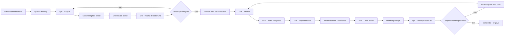
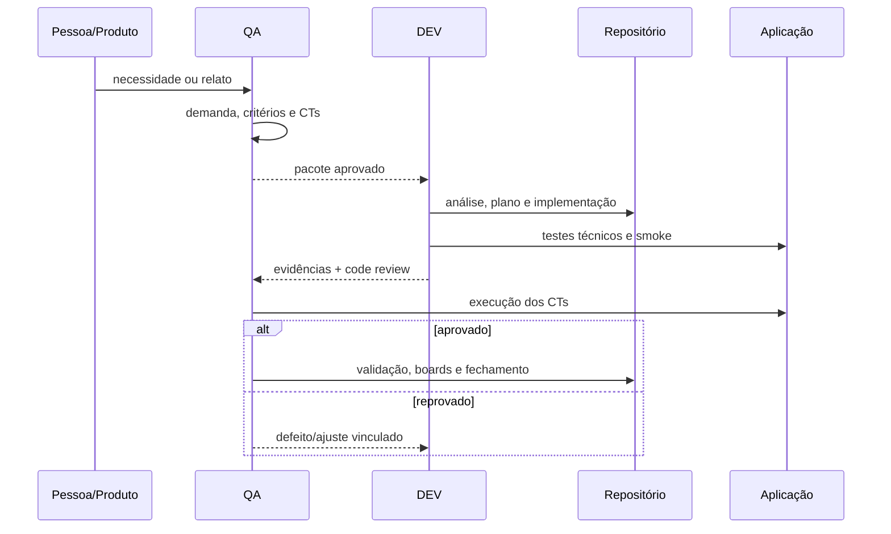

# Fluxo QA → DEV

Esta página é a referência operacional para qualquer projeto dentro do Operating Vault. O arquivo [Fluxo QA DEV.excalidraw](Fluxo%20QA%20DEV.excalidraw) complementa esta visão com o desenho visual; esta nota define o contrato que deve ser seguido.

## Entrada em um chat novo

Quando uma pessoa apresenta uma nova melhoria, bug ou necessidade, a skill `qa-first-delivery` é o ponto de entrada automático. Não é necessário explicar novamente o processo nem chamar a skill manualmente.

Depois do gate QA, o próximo responsável é `$dev-execution`. A troca é determinada pelos artefatos e pelo status da demanda, não por uma palavra-chave específica. Se o gate não estiver pronto, o fluxo permanece em QA.

## Visão geral

## Responsabilidades

| Etapa | Dono | Entrada | Saída |
|---|---|---|---|
| Triagem e definição | QA | ideia, relato ou necessidade | demanda classificada |
| Critérios e cobertura | QA | demanda | critérios, CTs, matriz e validação preparada |
| Handoff | QA | pacote íntegro | demanda pronta para DEV |
| Análise e plano | DEV | pacote QA aprovado | decisão técnica e plano congelado |
| Implementação | DEV | plano | código, testes e documentação |
| Code review | DEV | implementação verificada | execução pronta para QA |
| Validação funcional | QA | aplicação + CTs | aprovado, reprovado ou bloqueado |
| Fechamento | QA + DEV | validação aprovada | boards, roadmap e arquivo sincronizados |

## Regras de passagem

1. A pasta da demanda nasce copiando o template oficial; o template nunca é reconstruído manualmente.
2. Cada critério `C1..Cn` tem pelo menos um CT e cada CT aponta para um critério.
3. A execução DEV só nasce depois do gate QA; a pasta é criada copiando `Templates/Execução/`.
4. O DEV não altera o contrato funcional para acomodar a implementação. Mudança de comportamento retorna para QA.
5. Build verde e testes técnicos verdes não equivalem à aprovação funcional dos CTs.
6. Toda transição atualiza frontmatter, README, board, roadmap e links relacionados.
7. Falha de CT em DEV gera defeito/ajuste vinculado; não se apaga nem se reescreve o histórico da demanda pai.

## Artefatos por etapa

### QA

- `03 Trabalho/QA/<projeto>/Demandas/<tipo>/<ID>/00 README.md`
- `01 - Demanda.md`
- `02 - Plano de teste.md`
- `03 - Casos de teste.md`
- `04 - Validação dev.md`
- `05 - Preparação Qase.md`, quando aplicável

### DEV

- `03 Trabalho/DEV/<projeto>/Execuções/<ID>/00 README.md`
- `01 - Análise.md`
- `02 - Plano de execução.md`
- `03 - Implementação.md`
- `04 - Code review.md`

## Fluxo entre pessoas e sistema

## Skills associadas

- `$qa-first-delivery`: organiza a entrada, templates, critérios, CTs e gate QA.
- `$dev-execution`: executa o pacote aprovado, registra evidências e devolve para QA.

As skills são reutilizáveis em outros projetos; os caminhos concretos de templates, boards e IDs continuam sendo definidos pelo vault do projeto.

O usuário não precisa escolher a skill seguinte: a etapa atual define o próximo responsável. A chamada explícita das skills continua disponível, mas é opcional.
