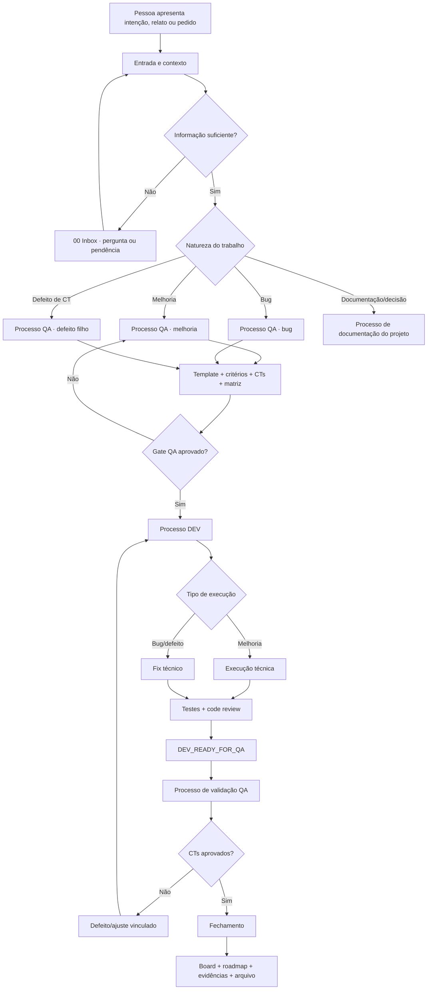

# Mapa geral de processos

Este é o mapa dos processos universais do Operating Vault. Ele mostra o caminho do trabalho desde a entrada até o fechamento, independentemente do projeto, produto ou tecnologia.

## Mapa visual



## Hierarquia de processos

| Ordem | Processo | Pergunta que responde | Saída |
|---:|---|---|---|
| 00 | Entrada e contexto | O que está sendo pedido e em qual projeto? | contexto suficiente ou pendência no Inbox |
| 01 | QA | O que precisa ser observado e aceito? | demanda, critérios, CTs, matriz e gate |
| 02 | DEV | Como implementar o contrato aprovado? | código, testes, review e handoff |
| 03 | Validação QA | O comportamento entregue atende aos CTs? | aprovado, reprovado ou bloqueado |
| 04 | Fechamento | O histórico está sincronizado e recuperável? | boards, roadmap, evidências e arquivo |
| transversal | Documentação | A decisão e o processo continuam compreensíveis? | diagramas, links e documentação atualizados |

## Estados do processo

```text
Entrada → Triagem → QA → Handoff QA → DEV → Handoff DEV → Validação QA → Fechamento → Arquivo
             ↑          │                         │              │
             └──────────┘                         └──────────────┘
              pendência                      defeito ou ajuste
```

## Fontes canônicas

- Entrada e roteamento: [[Agentes/README|Agentes — entrada e roteamento]].
- Arquitetura das camadas: [[Arquitetura operacional|Arquitetura operacional]].
- Roteamento de skills: [[Fluxo geral de skills|Fluxo geral de skills]].
- Contrato QA → DEV: [[Fluxo QA DEV|Fluxo QA → DEV]].
- Interação entre orquestradores: [[Interação entre skills QA DEV|Interação entre skills QA ↔ DEV]].
- Modelos: [[Templates/00 README|Templates]].

## Regra de leitura

O processo é universal; o conteúdo concreto é sempre resolvido pelo projeto identificado na entrada. Nenhuma regra de domínio deve ser adicionada a este documento. Regras de um produto devem ficar em `04 Projetos/<projeto>/` e os artefatos da execução em `03 Trabalho/<camada>/<projeto>/`.
