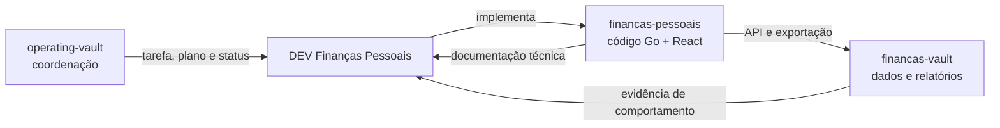
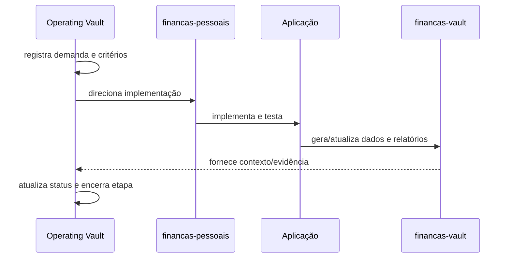

# Fluxo de trabalho do projeto

Este diagrama mostra como o projeto é coordenado, implementado e consumido. Os três espaços têm responsabilidades diferentes.

## Fluxo de uma entrega

## Responsabilidade de cada local

| Local | Faz | Não faz |
|---|---|---|
| `operating-vault` | coordena trabalho, roadmap, status e decisões | não contém código da aplicação |
| `financas-pessoais` | contém backend, frontend, testes e documentação técnica | não é o painel financeiro diário |
| `financas-vault` | contém dados, painéis, relatórios e fluxos de uso | não coordena execução nem substitui o banco |

## Regra de partida

Toda nova etapa começa no `operating-vault`, aponta para o repositório técnico, atualiza a documentação de fluxos e só depois altera o vault financeiro quando houver saída de dados ou relatório.
