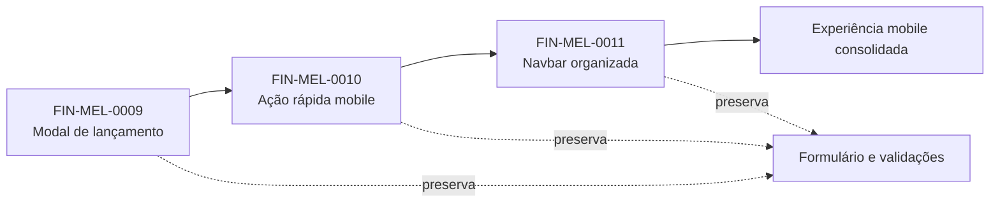

# FIN-EPIC-0001 — Evolução da experiência de lançamentos mobile

> [!info]- Navegação do épico
> **Projeto:** [[04 Projetos/Financas Pessoais/README|Finanças Pessoais]]  
> **Roadmap:** [[04 Projetos/Financas Pessoais/02 Roadmap|Roadmap]]  
> **Board QA:** [[01 Board/QA/BOARD QA — Financas Pessoais|Board QA]]  
> **Board DEV:** [[01 Board/DEV/BOARD DEV — Financas Pessoais|Board DEV]]

## Objetivo

Evoluir o fluxo de lançamentos no celular para que o acompanhamento seja a tela principal, o cadastro seja uma ação rápida e a navegação permaneça compacta, acessível e extensível.

## Escopo do épico

- Abrir o cadastro de despesa/receita por modal responsivo.
- Manter o novo lançamento como ação rápida fora da navegação principal.
- Organizar a navbar como uma coleção de destinos, com distribuição automática e ícones acessíveis.
- Preservar formulário, validações, API, regras financeiras e comportamento desktop.

## Fora de escopo

- Novas regras financeiras.
- Parcelas, recorrências ou faturas.
- Alteração de backend ou banco de dados.
- Migração ou sincronização com o `financas-vault`.

## Demandas vinculadas

| ID | Demanda | Relação | Estado |
|---|---|---|---|
| FIN-MEL-0009 | [[03 Trabalho/QA/Financas Pessoais/Demandas/Melhorias/FIN-MEL-0009 Navegação lançamento modal/00 README|Navegação do lançamento por modal]] | início do fluxo | Concluído |
| FIN-MEL-0010 | [[03 Trabalho/QA/Financas Pessoais/Demandas/Melhorias/FIN-MEL-0010 Ação novo lançamento mobile/00 README|Ação de novo lançamento mobile]] | evolução da ação rápida | Concluído |
| FIN-MEL-0011 | [[03 Trabalho/QA/Financas Pessoais/Demandas/Melhorias/FIN-MEL-0011 Organização navbar mobile/00 README|Organização da navbar mobile]] | evolução da navegação | QA · Triagem |

### Dependências anteriores

- [[03 Trabalho/QA/Financas Pessoais/Demandas/Melhorias/FIN-MEL-0006 Navegação estilo aplicativo/00 README|FIN-MEL-0006 — Navegação estilo aplicativo]] fornece a base da navegação mobile.

`FIN-MEL-0008 — Parcelas` não pertence a este épico: é uma capacidade de negócio independente, ainda que use o mesmo formulário de lançamento.

## Fluxo do épico

## Status consolidado

| Gate | Situação |
|---|---|
| Escopo do épico | ✅ definido |
| Demandas e dependências | ✅ vinculadas |
| Implementação `0009` | ✅ concluída |
| Implementação `0010` | ✅ concluída |
| Code review `0009/0010` | ✅ aprovado tecnicamente |
| Validação QA `0009/0010` | ✅ aprovada |
| Preparação `0011` | 🔵 em QA |
| Implementação `0011` | ⏳ bloqueada pelo gate QA |

## Critério de conclusão

O épico será concluído quando as três demandas vinculadas estiverem com CTs aprovados, boards sincronizados, documentação técnica atualizada e nenhuma pendência funcional aberta.
