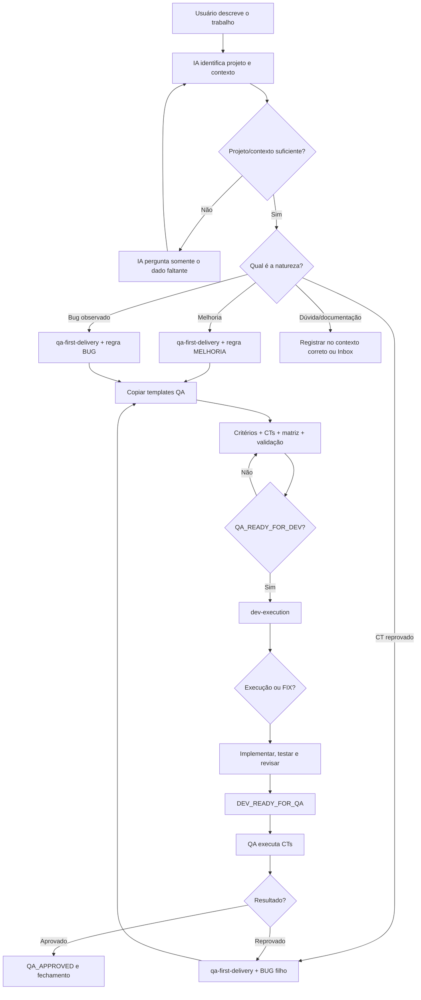

# Agentes — entrada e roteamento

Esta página explica como uma pessoa e uma IA iniciam qualquer trabalho no Operating Vault. Ela é universal e não contém regras específicas de nenhum projeto.

## Como o usuário inicia

O usuário pode escrever naturalmente, por exemplo:

- “quero criar uma melhoria para o cadastro”;
- “encontrei um bug ao salvar”;
- “o CT falhou neste comportamento”;
- “preciso atualizar a documentação deste projeto”.

Não é necessário informar o nome da skill. A IA deve identificar o contexto e seguir o fluxo.

## Fluxo de entrada

## O que a IA deve fazer

1. Identificar o projeto, o repositório/vault relacionado e o objetivo.
2. Se faltar contexto essencial, perguntar antes de criar arquivos.
3. Classificar como melhoria, bug, defeito filho ou demanda documental.
4. Acionar a etapa QA; não começar pelo DEV quando ainda não existe contrato funcional.
5. Copiar o template oficial e adaptar seus campos, preservando a estrutura.
6. Atualizar o Operating Vault no caminho do projeto, sem mover regras específicas para os documentos universais.
7. Emitir ou reconhecer os handoffs conforme o estado da demanda.

## O que pertence a cada lugar

| Local | Conteúdo |
|---|---|
| `Skills/` | processo universal reutilizável |
| `Templates/` | estrutura universal dos artefatos |
| `Agentes/` | instruções universais de entrada e roteamento |
| `01 Board/Processos/` | fluxos universais e contratos entre etapas |
| `04 Projetos/<projeto>/` | contexto, domínio, decisões, roadmap e agentes específicos |
| `03 Trabalho/<camada>/<projeto>/` | demandas e execuções concretas |
| repositório do produto | código, testes e documentação técnica do produto |

## Handoff e continuidade

O usuário pode dizer “siga”, “continue” ou descrever o próximo passo. A IA deve usar o estado dos artefatos para decidir a etapa; não deve pular gates apenas por causa da palavra usada.

- Entrada/triagem → `qa-first-delivery`
- `QA_READY_FOR_DEV` → `dev-execution`
- `DEV_READY_FOR_QA` → `qa-first-delivery`
- `QA_REJECTED` → correção/defeito via `dev-execution`
- `QA_APPROVED` → fechamento e arquivo

Os agentes universais legados continuam disponíveis como referências detalhadas:

- [[PROCESSAR|PROCESSAR]] — destilação de material bruto e roteamento.
- [[FIXAR|FIXAR]] — execução de melhoria ou correção após o pacote estar pronto.
